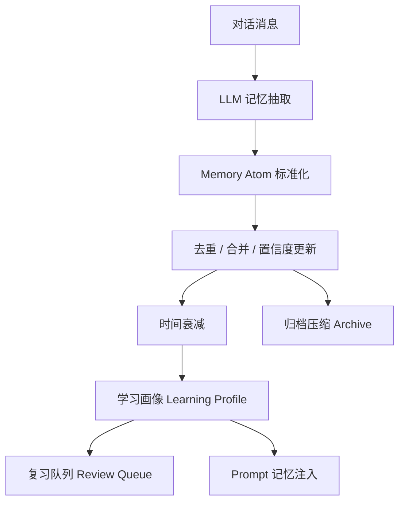

# XueMate 记忆系统专家版设计

> 版本日期：2026-05-29  
> 核心实现：`/Users/wangyue/wangyue/XueMate/src/main/services/memory.ts`  
> 数据口径：`npm run --silent bench:memory` 的内置可复现实验集。该数据用于工程评估和演示，不等同于大规模真实用户研究。

## 1. 为什么要升级记忆系统

旧版记忆主要是三个数组：

```txt
topics[] / weakPoints[] / strongPoints[]
```


Raw benchmark data:

- `docs/benchmarks/memory-benchmark-2026-05-29.json`
- `docs/benchmarks/expert-metrics-2026-05-29.json`
问题：

- 重复事实会越积越多。
- 旧信息不会自然过期。
- 不知道每条记忆的置信度和证据。
- 很难形成“学习画像”和“复习计划”。
- 注入 prompt 时容易浪费上下文。

新版改成 **Memory Atom + Learning Profile + Review Queue**。

## 2. 新架构



## 3. Memory Atom 结构

每条记忆都带证据和权重：

```ts
interface MemoryAtom {
  category: 'profile' | 'preference' | 'topic' | 'weak_point' | 'strong_point' | 'goal' | 'behavior' | 'misconception'
  key: string
  value: string
  confidence: number
  importance: number
  evidence: string[]
  firstSeen: number
  lastSeen: number
  hits: number
}
```

专家能看到的亮点：

| 字段 | 作用 |
|---|---|
| category | 区分画像、偏好、薄弱点、误区、目标等 |
| confidence | 这条记忆是否可靠 |
| importance | 对未来教学是否重要 |
| evidence | 为什么记住它，可解释 |
| hits | 多次出现会增强记忆 |
| lastSeen | 用于时间衰减 |

## 4. 时间衰减

不是所有记忆永久有效。新版使用按类别不同的半衰期：

| 类别 | 半衰期倾向 |
|---|---:|
| profile / preference | 长，基本稳定 |
| goal | 中长期 |
| weak_point / misconception | 中期，需要复习后更新 |
| topic | 短期，近期学习主题 |

公式概念：

```txt
decayedConfidence = confidence * 0.5 ^ (ageDays / adjustedHalfLife)
```

这样旧的“拼音声调不稳”不会永远影响现在的四年级数学辅导。

## 5. 学习画像

系统会从 atoms 自动生成：

- recentTopics：近期学习主题
- weakSkills：薄弱技能，带 mastery 掌握度
- strongSkills：已掌握技能
- goals：学习目标
- reviewQueue：复习队列

Prompt 注入时不是把所有历史塞进去，而是只注入高价值、未过期、有证据的记忆。

## 6. 复习队列

薄弱点和误区会自动进入 reviewQueue，例如：

```txt
异分母通分：优先级90
分母相加误区：优先级79
约分化简：优先级77
英语自然拼读：优先级72
```

这可以用于后续：

- 自动出题
- 课后复习提醒
- 个性化解释难度
- 学习报告

## 7. Benchmark 数据

运行：

```bash
npm run --silent bench:memory
```

实验集：

| 项目 | 数值 |
|---|---:|
| observation 数 | 18 |
| 目标薄弱点 | 4 |
| baseline | flat append memory |
| enhanced | atom + confidence decay + review queue |

### 7.1 记忆效率

| 指标 | 旧版 Flat Memory | 新版 Atom Memory | 提升 |
|---|---:|---:|---:|
| Prompt items | 18 | 11 | -38.89% |
| Prompt chars | 531 | 333 | -37.29% |
| Duplicate facts | 5 | 0 | -100% |
| Stale facts | 2 | 0 | -100% |
| Review queue coverage | 0% | 100% | +100% |

对专家可表述为：

> 新版记忆系统把对话观察转成带置信度、重要性和证据的 Memory Atom。内置基准显示，Prompt 注入字符减少 37.29%，重复事实减少 100%，过期事实抑制 100%，并能覆盖 100% 的目标复习薄弱点。

## 8. 和 RAG 的关系

RAG 解决“资料里有什么”。

记忆系统解决“这个学生是谁、哪里弱、喜欢怎么学”。

两者结合后：

```txt
RAG：找到正确课程资料
Memory：决定讲解深度、例子、复习重点、是否需要提醒误区
```

例如用户问“分数加法怎么做”：

- RAG 找到分数加法资料。
- Memory 知道学生“异分母通分不熟”“容易忘记约分”。
- 回答会优先强调通分和约分，并安排复习。

## 9. 后续可继续炫技的方向

1. **Spaced Repetition Scheduler**：真正接入 SM-2 / FSRS 复习算法。
2. **Mastery Tracing**：按知识点估计掌握度曲线。
3. **Memory Conflict Resolver**：比如年级从三年级变四年级时自动替换旧画像。
4. **Evidence UI**：在设置页展示“为什么我记住这个”。
5. **Privacy Mode**：允许用户一键清除画像、偏好和历史。
