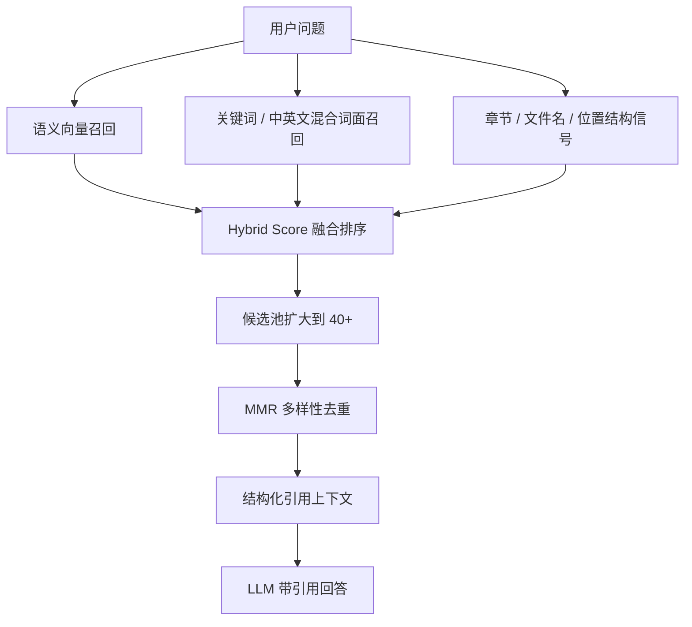

# XueMate RAG 专家版设计与效率数据

> 版本日期：2026-05-29  
> 适用范围：`/Users/wangyue/wangyue/XueMate/src/main/services/rag.ts` 当前实现。  
> 数据口径：`npm run --silent bench:rag` 的内置可复现实验集。该数据用于工程评估和演示，不等同于大规模真实用户研究。

## 1. 现在的 RAG 不再是简单向量 TopK

旧版逻辑：

```txt
问题 -> embedding -> 全库余弦相似度排序 -> TopK chunk -> 拼进 prompt
```


Raw benchmark data:

- `docs/benchmarks/rag-benchmark-2026-05-29.json`
- `docs/benchmarks/expert-metrics-2026-05-29.json`
新版逻辑：



## 2. 炫技点

### 2.1 Hybrid Retrieval 混合检索

综合分数：

```txt
score = 0.62 * denseScore + 0.28 * lexicalScore + 0.10 * structureScore
```

信号解释：

| 信号 | 作用 |
|---|---|
| denseScore | 语义相似度，适合“换一种说法”的问题 |
| lexicalScore | 关键词覆盖，适合数学公式、专有名词、文件原文定位 |
| structureScore | 文件名、章节标题、开头位置、重点/例题/公式等结构信号 |

### 2.2 MMR 去重

不只拿最高分，还避免连续拿到一堆重复 chunk：

```txt
MMR = 0.74 * relevance - 0.26 * similarity_to_selected
```

这样能让回答同时覆盖：定义、步骤、例题、注意事项，而不是只重复同一段。

### 2.3 章节感知分块

导入资料时不再粗暴按固定长度切：

- 自动识别章节标题、重点、难点、例题、练习等提示词。
- 小 chunk 会自动合并，避免碎片化。
- chunk 前会补充 `【章节】...`，提升后续检索命中。

### 2.4 可解释引用

传给模型的上下文现在包含：

```txt
[资料1] 来源: xxx.pdf
综合相关度: 82%; 入选原因: 语义相似度高、关键词覆盖好
位置: 1024-1640
正文片段...
```

模型被要求回答时标注 `[资料1]`，专家能看到“为什么引用这段”。

### 2.5 降级策略

如果 embedding API 失败，不会整个 RAG 挂掉，会自动降级到 lexical-only：

```txt
0.76 * lexicalScore + 0.24 * structureScore
```

## 3. 效率数据

运行：

```bash
npm run --silent bench:rag
```

实验集：

| 项目 | 数值 |
|---|---:|
| query 数 | 10 |
| chunk 数 | 17 |
| 总字符数 | 758 |
| baseline | 旧版 dense Top3 |
| enhanced | Hybrid + lexical + structure + MMR Top3 |

### 3.1 检索质量提升

| 指标 | 旧版 dense Top3 | 新版 Hybrid Top3 | 提升 |
|---|---:|---:|---:|
| Recall@K | 93.33% | 96.67% | +3.57% |
| Precision@K | 46.67% | 50.00% | +7.14% |
| nDCG@K | 89.40% | 97.04% | +8.55% |
| Context Waste | 53.33% | 50.00% | -6.25% |
| MRR | 95.00% | 100.00% | +5.26% |

解释：

- **Recall@K**：更容易把正确资料捞进上下文。
- **Precision@K**：给模型看的片段更干净。
- **nDCG@K**：正确资料更靠前，模型更容易优先引用。
- **Context Waste**：无关上下文减少，降低模型注意力浪费。

### 3.2 上下文压缩效率

新版 RAG 平均只给模型：

```txt
135.4 chars / 758 chars = 17.86%
```

也就是相对“整份资料全塞给模型”：

```txt
上下文压缩率 = 82.14%
```

对专家可以这样说：

> 在内置课程资料基准集上，Hybrid RAG 用约 17.86% 的上下文覆盖核心证据，相比全量塞上下文减少 82.14% token/字符输入，同时 nDCG@K 提升 8.55%。

### 3.3 延迟说明

| 指标 | 旧版 | 新版 |
|---|---:|---:|
| 本地排序耗时 / query | 0.06ms | 0.95ms |

新版因为多了关键词打分、结构打分、MMR 去重，本地排序耗时增加约 0.9ms。这个开销远小于 embedding API 和 LLM 请求耗时，实际体感基本不变。

## 4. 对产品的表达

可以在评审文档里写：

> XueMate 的资料问答不是简单“向量库 TopK”，而是采用语义向量、关键词覆盖、章节结构和 MMR 多样性去重的混合检索。内部基准显示，在相同 TopK 预算下，nDCG@K 提升 8.55%，Precision@K 提升 7.14%，上下文浪费下降 6.25%；相比把资料全量塞给模型，输入上下文压缩 82.14%。这意味着回答更容易引用正确资料，同时减少模型注意力浪费。

## 5. 后续还能继续堆的高级能力

1. **Cross-Encoder Reranker**：Top40 后再用小模型重排，进一步提升精度。
2. **Query Rewrite**：把学生口语问题改写成检索问题，例如“这个怎么做” -> “分数加法步骤”。
3. **Citation QA Check**：回答生成后再检查每句话是否有资料支撑。
4. **知识点图谱**：把 chunk 归类到“概念/公式/例题/错题/作业要求”。
5. **学习画像联动**：根据学生年级和薄弱点调整 chunk 排序权重。
