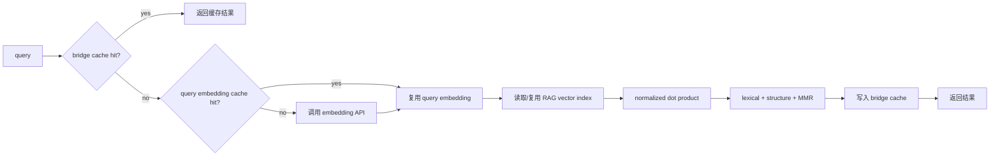

# XueMate RAG / MCP 性能加速说明

本次优化聚焦前四个速度项：RAG 向量索引、query embedding 缓存、预归一化 dot product、Electron bridge 二级缓存。目标是让“同一学习场景反复查询 / 图谱切换 / MCP tool 重复调用”从数百毫秒级下降到毫秒级，同时保持真实数据链路，不使用 mock。

## 1. RAG chunk embedding 内存索引

- 模块：`/Users/wangyue/wangyue/XueMate/src/main/services/ragVectorIndex.ts`
- 做法：第一次按 `collectionId` 从 SQLite 读取 chunk embedding 后，转换为 `Float32Array` 并缓存在内存。
- 检索时不再每次执行 `findChunkEmbeddings* -> Buffer -> number[]` 的完整链路，而是复用内存索引。
- 数据变更后失效：`importDocument()` / `deleteDocument()` 会调用 `invalidateVectorIndex(collectionId)`。

## 2. query embedding 缓存

- 模块：`/Users/wangyue/wangyue/XueMate/src/main/services/ragQueryCache.ts`
- 默认 TTL：10 分钟。
- 默认容量：256 条。
- 并发同 key 请求会复用同一个 pending producer，避免同一问题同时打多次 embedding API。
- 关闭方式：

```bash
XUEMATE_RAG_QUERY_CACHE_TTL_MS=off
# 或
XUEMATE_RAG_QUERY_CACHE_MAX_ENTRIES=off
```

## 3. 向量预归一化 + 高速 dot product

- 模块：`/Users/wangyue/wangyue/XueMate/src/main/services/vectorMath.ts`
- 导入资料时将 chunk embedding L2 归一化后写入 BLOB。
- 加载旧资料时在内存索引中归一化，兼容历史数据。
- 检索时 query embedding 归一化一次，然后对索引向量直接 `dotProduct(query, chunk)`。
- 这样把原来的 cosine 计算：

```txt
dot / (sqrt(normA) * sqrt(normB))
```

变成：

```txt
dot(normalizedQuery, normalizedChunk)
```

避免每个 chunk 重复开方与数组分配。

## 4. Electron rendererBridge 二级缓存

- 模块：`/Users/wangyue/wangyue/XueMate/src/main/services/bridgeCache.ts`
- 默认 TTL：30 秒。
- 默认容量：128 条。
- 关闭方式：

```bash
XUEMATE_BRIDGE_CACHE=off
XUEMATE_BRIDGE_CACHE_TTL_MS=off
XUEMATE_BRIDGE_CACHE_MAX_ENTRIES=off
```

缓存接口：

```txt
GET  /api/rag/collections
GET  /api/rag/documents
GET  /api/rag/stats
GET  /api/rag/learningGraph
GET  /api/memory
GET  /api/memory/archive
POST /api/rag/retrieve
```

不缓存：

```txt
POST /api/quick-search/run
```

单次绕过：

```txt
?noCache=1
?no_cache=1
body.noCache=true
body.no_cache=true
```

调试接口：

```txt
GET  /api/cache/stats
POST /api/cache/clear
```

## 真实链路实测

脚本：`/Users/wangyue/wangyue/XueMate/scripts/bench-mcp-layer.mjs`

运行：

```bash
npm run dev
MCP_BENCH_SAMPLES=8 MCP_BENCH_WARMUP=2 npm run bench:mcp
```

最新报告：`/Users/wangyue/wangyue/XueMate/docs/reports/mcp-benchmark-latest.md`

本轮结果摘要：

| 场景                         |     cold | bridge cached / MCP cached |     提升 |
| ---------------------------- | -------: | -------------------------: | -------: |
| learningGraph.default Direct |  11.93ms |                     0.74ms | 约 94.0% |
| learningGraph.default MCP    |  12.75ms |                     0.73ms | 约 94.3% |
| rag.retrieve Direct          | 724.06ms |                     0.94ms | 约 99.9% |
| rag.retrieve MCP             | 642.18ms |                     0.83ms | 约 99.9% |

说明：`rag.collections` / `health` 这类 sub-ms 轻接口会受计时抖动影响，缓存收益可能接近 0 或出现轻微负数；真正耗时的 RAG 检索与知识图谱链路收益最明显。

## 数据流变化


